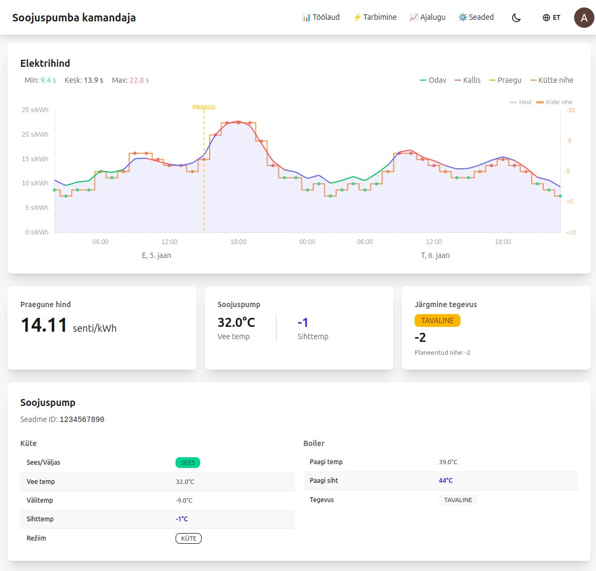
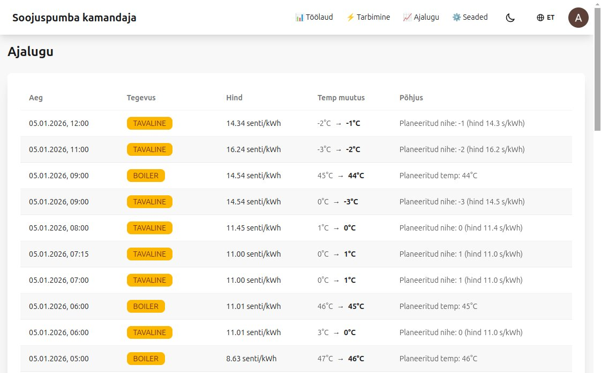

# Smart Heating Controller

Reduce your heating costs by automatically running your Daikin heat pump during cheap electricity hours.

**[Try it free at daikin-controller.pages.dev](https://daikin-controller.pages.dev/)**

## What It Does

This app connects to your Daikin heat pump and automatically adjusts the heating based on real-time electricity prices. It heats more during cheap hours and less during expensive hours, reducing your electricity bill without sacrificing comfort.

The app uses Estonian electricity market prices from Elering and plans your heating schedule every day around 3 PM when tomorrow's prices become available.

## Screenshots

**Dashboard** - See electricity prices, current heat pump status, and upcoming actions:

**History** - Track all automatic control actions with timestamps and reasons:

## Features

- **Smart scheduling** - Automatically heats during cheap electricity hours
- **Price visualization** - See today's and tomorrow's electricity prices on a chart
- **Energy tracking** - Monitor your heating consumption and estimated costs
- **Hot water control** - Optimize your boiler heating too
- **Weather-aware** - Adjusts heating based on outdoor temperature forecasts
- **Multi-language** - Available in Estonian and English
- **Dark mode** - Easy on the eyes

## Getting Started

1. Go to [daikin-controller.pages.dev](https://daikin-controller.pages.dev/)
2. Sign in with your Google account
3. Connect your Daikin account (the app will guide you through the Daikin Onecta authorization)
4. That's it! The default settings work well for most users

## Requirements

- **Daikin heat pump** with cloud connectivity (Daikin Onecta compatible)
- **Google account** for sign-in
- Currently works with **Estonian electricity prices** (Elering market data)

## Feedback & Issues

If you encounter any problems or have suggestions, please [open an issue on GitHub](https://github.com/aivo/daikin-controller/issues).
